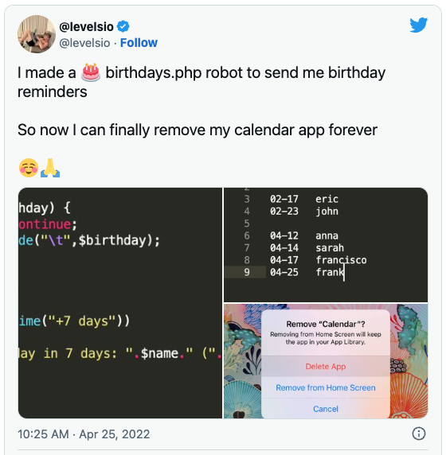

# Telegram Birthday GH-Action

Inspired by this [this](https://twitter.com/levelsio/status/1518506440939683840) tweet from [@levelsio](hhttps://twitter.com/levelsio) I decided to create a GitHub Action that utilizes the cron functionality to birthday reminder via Telegram.


## Setup Actions

To Setup the Action simply copy the Template Repository from [here]()

*Make sure the repository is private, you don't want to share your all your birthdays with the world*

### Step 1 - Create a Telegram Bot

To create a Telegram Bot you can follow the instructions [here](https://core.telegram.org/bots#6-botfather)

### Step 2 - Setup the Repository Secrets

You need to add the following secrets to your repository:

`BOT_TOKEN` - The token you received from the BotFather
`CHAT_ID` - The Chat ID of the chat you want to send the messages. Find out how to get the Chat ID [here](https://stackoverflow.com/questions/32423837/telegram-bot-how-to-get-a-group-chat-id)

### Step 3 - Setup the Birthday File

The Birthday File is a yaml file located at the root of the repository. It contains the birthdays of the people you want to be reminded of. The file should look like this:
```yaml
timezone: Europe/Berlin
birthdays:
  - name: Example User
    date: 1980-02-26
  - name: Example User 2
    date: 1980-02-24
  - name: Example User
    date: 02-26
  - name: Example User 2
    date: 02-24
  - name: Example User 5
    date: 1980-02-28
```

The `timezone` needs to be set. To find the correct timezone you can use [this](https://en.wikipedia.org/wiki/List_of_tz_database_time_zones) list.

The `birthdays` section contains a list of all the birthdays. The `name` is the name of the person and the `date` is the date of the birthday. The date can be in the format `YYYY-MM-DD` or `MM-DD`. If the date is in the format `MM-DD` can be used if you don't want to specify the year or don't know the year.

### Step 4 - Configure the GitHub Action

The Cron Job is used to schedule the Action. You can find it inside the `.github/workflows/birthday.yml` file. You need to change the daily cron job to the time you want to be reminded of the birthdays. Githug Actions uses UTC time, so you need to convert your local time to UTC. You can use following website to convert the time: [here](https://www.timeanddate.com/worldclock/converted.html?p1=0&p2=37)

#### More Configurations
You can also configure the `first_reminder` and `second_reminder` to change the time the reminders are sent. 
```yaml
first_reminder: 2 # remind me 2 days before birthday
second_reminder: 4 # remind me 4 days before birthday
```
